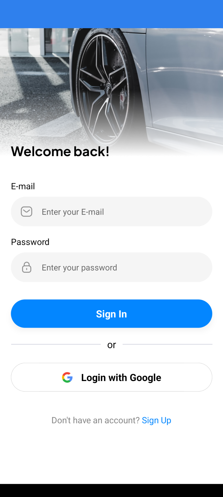

# Uber Clone

A full-featured ride-hailing application built with Expo (React Native) that includes authentication, real-time location tracking, ride booking, and payments.

## Screenshots

<table>
  <tr>
    <td></td>
    <td></td>
  </tr>
  <tr>
    <td></td>
    <td></td>
  </tr>
</table>

## Features

- 🔐 Authentication with Clerk (Email + Google OAuth)
- 📍 Real-time location tracking with Expo Location
- 🗺️ Google Maps integration for navigation
- 💳 Stripe payment processing
- 💬 Chat functionality
- 🚗 Driver selection and ride booking
- 📱 Beautiful UI with Tailwind CSS

## Tech Stack

- [Expo](https://expo.dev) - React Native framework
- [Clerk](https://clerk.com) - Authentication and user management
- [Google Maps API](https://developers.google.com/maps) - Maps and location services
- [Stripe](https://stripe.com) - Payment processing
- [NeonDB](https://neon.tech) - PostgreSQL database
- [TailwindCSS](https://tailwindcss.com) - Styling

## Getting Started

### Prerequisites

- Node.js (v18 or higher)
- npm or yarn
- Expo CLI
- Valid API keys for:
  - Clerk
  - Google Maps
  - Stripe
  - NeonDB

### Environment Setup

1. Clone the repository
2. Create a `.env` file in the root directory with the following variables:

```bash
EXPO_PUBLIC_CLERK_PUBLISHABLE_KEY=your_clerk_key
DATABASE_URL=your_neondb_url
EXPO_PUBLIC_SERVER_URL=your_server_url
EXPO_PUBLIC_GEOAPIFY_API_KEY=your_geoapify_key
EXPO_PUBLIC_GOOGLE_API_KEY=your_google_maps_key
EXPO_PUBLIC_STRIPE_PUBLISHABLE_KEY=your_stripe_publishable_key
STRIPE_SECRET_KEY=your_stripe_secret_key
```

### Installation

1. Install dependencies:

   ```bash
   npm install
   ```

2. Start the development server:

   ```bash
   npx expo start
   ```

3. Run on your preferred platform:
   - Press `a` for Android
   - Press `i` for iOS
   - Press `w` for web

## Project Structure

- `/app` - Main application code and routes
  - `/(api)` - API routes for backend functionality
  - `/(auth)` - Authentication related screens
  - `/(root)` - Main app screens and tabs
- `/components` - Reusable React components
- `/constants` - App constants and assets
- `/lib` - Utility functions and helpers
- `/store` - Global state management with Zustand
- `/types` - TypeScript type definitions

## Contributing

Contributions are welcome! Please feel free to submit a Pull Request.

## License

This project is licensed under the MIT License - see the [LICENSE](LICENSE) file for details.
